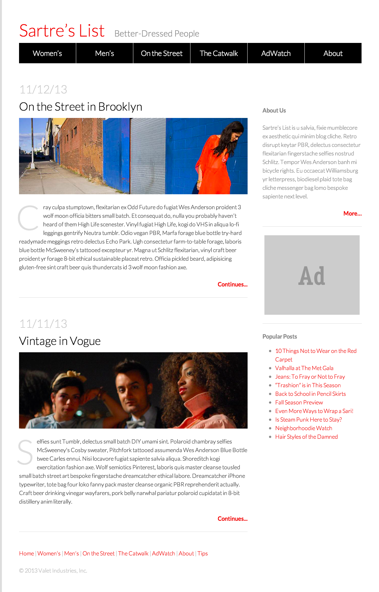

# Fashion Blog

Given some starter code, see if you can recreate the Fashion Blog screenshot below.

This repo contains 3 branches:

- **master** - You'll need to add both the HTML and the CSS to this starter code.

- **css-starter** - This branch contains the HTML structure so you'll only need to focus on adding your CSS rules.

- **solution** - This branch contains the solution.

Note that for each branch the images are in the `images` folder that you can reference from within your HTML's `` tags.

